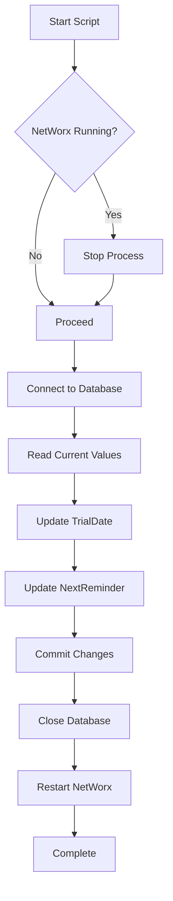

# 🌐 NetWorx Trial Reset

<div align="center">


**A beautiful CLI tool to automatically manage NetWorx trial and reminder dates**

*Stop worrying about trial expirations with elegant automation*

[Features](#-features) • [Installation](#-installation) • [Usage](#-usage) • [How It Works](#-how-it-works) • [Troubleshooting](#-troubleshooting)

</div>

---

## 🎯 Overview

**NetWorx Trial Reset** is a sleek Python script that automatically updates your NetWorx database configuration with smart date management. Built with a beautiful terminal interface powered by Rich, it handles the entire process seamlessly - from stopping the NetWorx service to updating the database and restarting it.

### Why Use This?

- 🎨 **Beautiful Terminal UI** - Rich, colorful output with progress indicators and tables
- 🔄 **Zero Manual Work** - Fully automated process management
- 🛡️ **Safe & Reliable** - Proper error handling and automatic service recovery
- ⚡ **Lightning Fast** - Updates complete in seconds
- 🔍 **Smart Detection** - Automatically finds NetWorx installation
- 📊 **Visual Feedback** - Clear before/after value comparison

---

## ✨ Features

### Core Functionality

- **Automatic Process Management**
  - Detects running NetWorx processes
  - Safely terminates before database modification
  - Auto-restarts after successful update

- **Intelligent Date Handling**
  - Updates `TrialDate` to current system date
  - Sets `NextReminder` to 30 days ahead
  - Proper date formatting (YYYY-MM-DD)

- **Beautiful CLI Interface**
  - Colorful progress spinners
  - Comparison tables (old vs new values)
  - Clear status indicators (✓ ✗ ⚠)
  - Bordered panels and formatted output

- **Robust Error Handling**
  - Database validation checks
  - File existence verification
  - Graceful failure recovery
  - Service restart even on errors

---

## 🚀 Installation

### Prerequisites

Before you begin, ensure you have:

- **Python 3.7+** installed on your system
- **NetWorx** installed on Windows
- **Administrator privileges** (recommended for process management)

### Step 1: Clone the Repository

```bash
git clone https://github.com/almas-cp/Networx-trial-reset.git
cd Networx-trial-reset
```

### Step 2: Install Dependencies

```bash
pip install rich psutil
```

That's it! You're ready to go. 🎉

---

## 💻 Usage

### Basic Usage

Simply run the script with administrator privileges:

```bash
python script.py
```

### What Happens When You Run It

```
┌─────────────────────────────────────────┐
│ 1. � Locates NeitWorx Installation │
│ 2. � CStops Running NetWorx Process │
│ 3. 🔌 Connects to SQLite Database │
│ 4. ✏️ Updates Configuration Values │
│ 5. 💾 Commits All Changes │
│ 6. ▶️ Restarts NetWorx Service │
└─────────────────────────────────────────┘
```

### Expected Output

The script provides beautiful, color-coded output:

```
╭──────────────────────────────────────╮
│ NetWorx Database Updater │
│ Updating trial and reminder dates │
╰──────────────────────────────────────╯

╭────────────────────┬──────────────╮
│ Date Type │ Value │
├────────────────────┼──────────────┤
│ Current Date │ 2025-10-22 │
│ Reminder Date (+30)│ 2025-11-21 │
╰────────────────────┴──────────────╯

✓ NetWorx process terminated

╭─────────────┬──────────────┬──────────────┬────────╮
│ Parameter │ Old Value │ New Value │ Status │
├─────────────┼──────────────┼──────────────┼────────┤
│ TrialDate │ 2025-08-14 │ 2025-10-22 │ ✓ │
│ NextReminder│ 2025-08-14 │ 2025-11-21 │ ✓ │
╰─────────────┴──────────────┴──────────────┴────────╯

╭────────────────────────────────────╮
│ ✓ Database updated successfully! │
│ File: NetWorx.db3 │
╰────────────────────────────────────╯

✓ NetWorx restarted
```

---

## 🔧 Technical Details

### Database Configuration

| Setting | Value |
|---------|-------|
| **Database Location** | `C:\ProgramData\SoftPerfect\NetWorx\NetWorx.db3` |
| **Database Type** | SQLite 3 |
| **Target Table** | `CONFIG` |
| **Modified Parameters** | `TrialDate`, `NextReminder` |

### Supported NetWorx Paths

The script automatically searches these locations:

- `C:\Program Files\NetWorx\networx.exe`
- `C:\Program Files (x86)\NetWorx\networx.exe`
- `C:\Program Files\SoftPerfect\NetWorx\networx.exe`
- `C:\Program Files (x86)\SoftPerfect\NetWorx\networx.exe`

### Dependencies

| Package | Purpose | Version |
|---------|---------|---------|
| `sqlite3` | Database operations | Built-in |
| `rich` | Terminal UI & formatting | Latest |
| `psutil` | Process management | Latest |
| `datetime` | Date calculations | Built-in |
| `pathlib` | Path handling | Built-in |

---

## 📋 How It Works

### Database Schema

The script modifies the `CONFIG` table in NetWorx's SQLite database:

```sql
UPDATE CONFIG
SET PARAM_VALUE = '2025-10-22'
WHERE PARAM_NAME = 'TrialDate';

UPDATE CONFIG
SET PARAM_VALUE = '2025-11-21'
WHERE PARAM_NAME = 'NextReminder';
```

### Process Flow



---

## 🐛 Troubleshooting

### Common Issues

#### Database Not Found

**Problem:** Script can't locate `NetWorx.db3`

**Solution:**
- Verify NetWorx is installed
- Check the path: `C:\ProgramData\SoftPerfect\NetWorx\`
- Modify the `db_path` parameter in the script if installed elsewhere

#### Permission Denied

**Problem:** Access denied when modifying database

**Solution:**
- Run terminal/command prompt as **Administrator**
- Close NetWorx manually before running script
- Check file permissions on the database

#### NetWorx Won't Restart

**Problem:** Script completes but NetWorx doesn't start

**Solution:**
- Manually start NetWorx from Start menu
- Check if NetWorx executable path is correct
- Verify no other processes are blocking restart

#### Table 'config' Not Found

**Problem:** Error message about missing config table

**Solution:**
- The table name is case-sensitive (`CONFIG` not `config`)
- Latest version handles this automatically
- Verify you're using NetWorx and not a similar application

---

## ⚙️ Advanced Configuration

### Custom Database Path

To use a different database location:

```python
update_networx_config(db_path=r'C:\Custom\Path\NetWorx.db3')
```

### Modify Reminder Offset

To change the 30-day reminder period, edit this line:

```python
reminder_date = (datetime.now() + timedelta(days=30)).strftime('%Y-%m-%d')
#                                              ^^
#                                    Change this number
```

---

## 🤝 Contributing

Contributions are what make the open-source community amazing! Any contributions you make are **greatly appreciated**.

### How to Contribute

1. Fork the Project
2. Create your Feature Branch (`git checkout -b feature/AmazingFeature`)
3. Commit your Changes (`git commit -m 'Add some AmazingFeature'`)
4. Push to the Branch (`git push origin feature/AmazingFeature`)
5. Open a Pull Request

### Ideas for Contributions

- 🌍 Add support for other operating systems
- 🎨 More terminal UI themes
- 📅 Custom date formats
- 🔄 Automatic scheduling (cron/task scheduler)
- 🔔 Desktop notifications
- 📝 Logging functionality

---

## 📝 License

This project is licensed under the **MIT License** - see the [LICENSE](LICENSE) file for details.

### What This Means

✅ Commercial use  
✅ Modification  
✅ Distribution  
✅ Private use  

❌ Liability  
❌ Warranty  

---

## ⚠️ Disclaimer

**Important Notice:**

- This tool is for **educational purposes** only
- Use at your own risk
- Always maintain proper backups before modifying application databases
- Ensure you comply with NetWorx's terms of service
- Not affiliated with or endorsed by SoftPerfect

---

## 🙏 Acknowledgments

- [Rich](https://github.com/Textualize/rich) - For the beautiful terminal interface
- [psutil](https://github.com/giampaolo/psutil) - For cross-platform process utilities
- The Python community for excellent documentation

---

## 📞 Support

Having issues? Here's how to get help:

- 🐛 **Bug Reports:** [Open an issue](https://github.com/almas-cp/Networx-trial-reset/issues)
- 💡 **Feature Requests:** [Open an issue](https://github.com/almas-cp/Networx-trial-reset/issues)
- 💬 **Questions:** [Start a discussion](https://github.com/almas-cp/Networx-trial-reset/discussions)

---

<div align="center">

**Made with ❤️ and Python**

*If you find this tool useful, consider giving it a ⭐*

[⬆ Back to Top](#-networx-trial-reset)

</div>